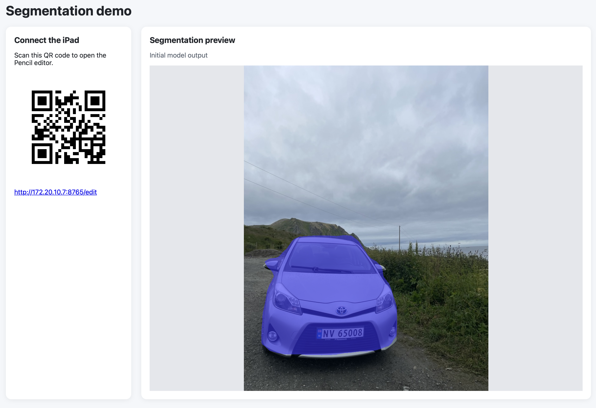
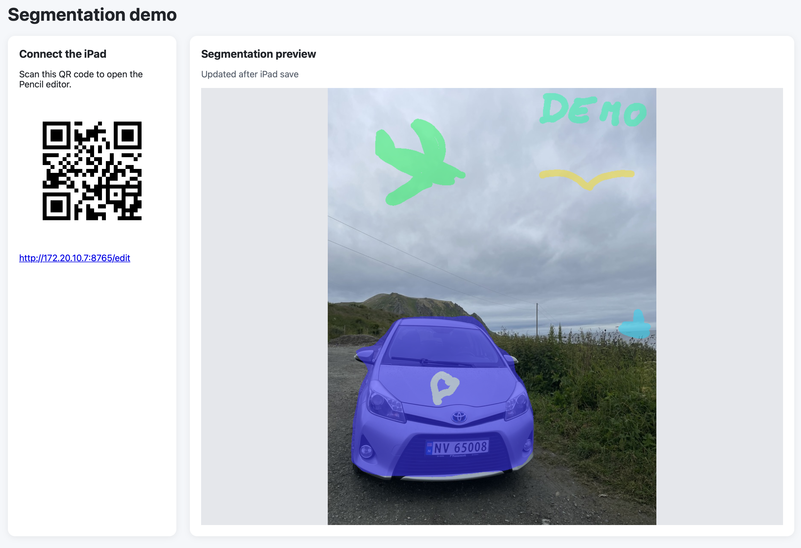
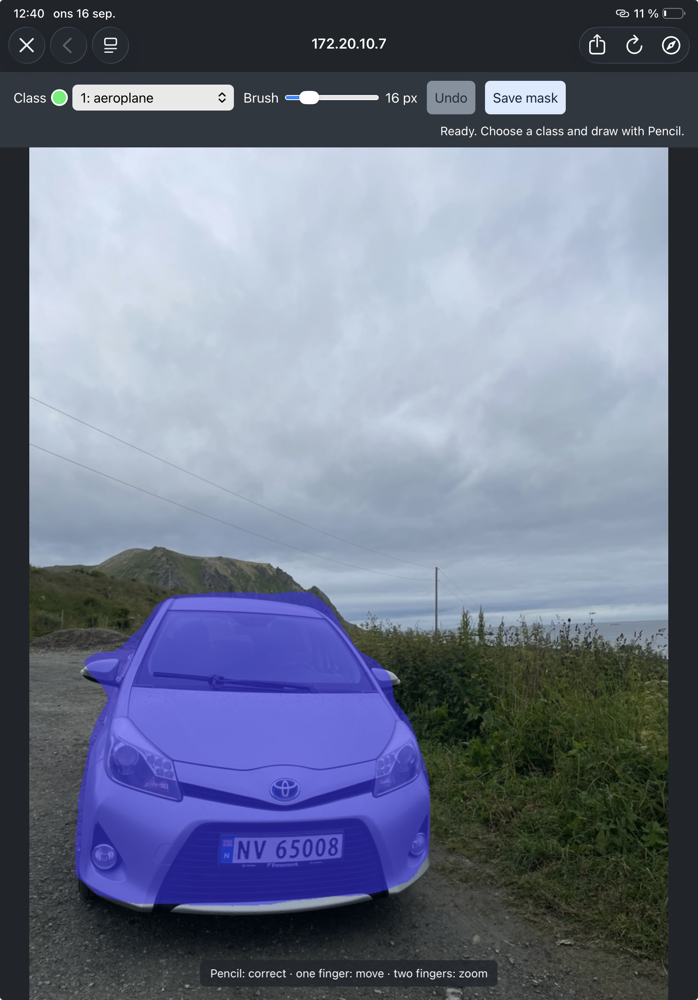
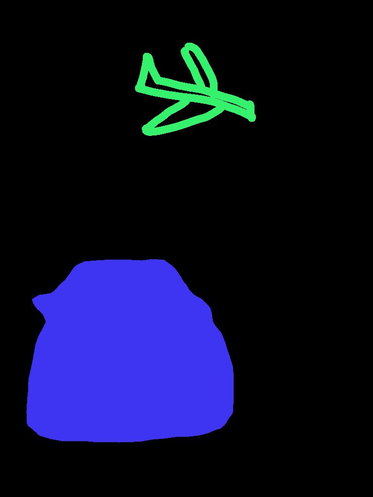

# iPad segmentation correction demo

This is a single-image local demo. A host computer runs segmentation, opens a
QR connection page, and saves Pencil corrections as a class-index PNG.

## Run

Use Python 3.10 or newer. Install dependencies:

```sh
python3 -m pip install -r requirements.txt
```

Start the demo with the included `demo/toyota.jpeg`:

```sh
python3 app.py
```

To use another image, pass its path: `python3 app.py /path/to/image.jpg`.

The first run downloads pretrained model weights. Scan the QR code in the
browser window with an iPad on the same Wi-Fi network. The host page shows the
initial segmentation over the image and refreshes after each iPad save. If the
printed iPad URL uses the wrong host address, pass `--lan-ip` with the correct
address. Use `--port`
if port 8765 is occupied. Use `--output /path/to/mask.png` to choose where the
corrected mask is saved.

On the iPad, use one finger to move the image, two fingers to zoom, and Apple
Pencil to assign the selected class. Select **background / erase** to remove a
class. A mouse can paint when trying the editor on the host. **Save mask**
writes `<image-name>_corrected_mask.png` by default. The PNG opens with visible
class colors, while its stored pixel values remain class IDs. Read those IDs
with `numpy.asarray(PIL.Image.open(path))`. It has the source image's oriented
width and height. The editor works on a copy no larger than 1600 pixels on its
longest side, so corrections to a larger source are resized with nearest-neighbor
sampling.

## Current demo workflow

This is the primary simple output.


The self-hosted websites allows the editing of the mask with an iPad (given they are in the same wifi).


Interface on the iPad


The correct mask gets saved again to the host computer.


## Connect another segmentation project

Replace `segment(image)` in `segmenter.py`. It receives a Pillow RGB image at
the editor resolution and must return a `(mask, class_names)` pair. `mask` is a
height-by-width NumPy `uint8` array of integer class IDs; `class_names[id]`
names each ID, with ID 0 used for background. The server and browser editor do
not depend on the model's implementation. This demo's default model uses the
21 Pascal VOC classes, so it does not identify objects outside that label set.
